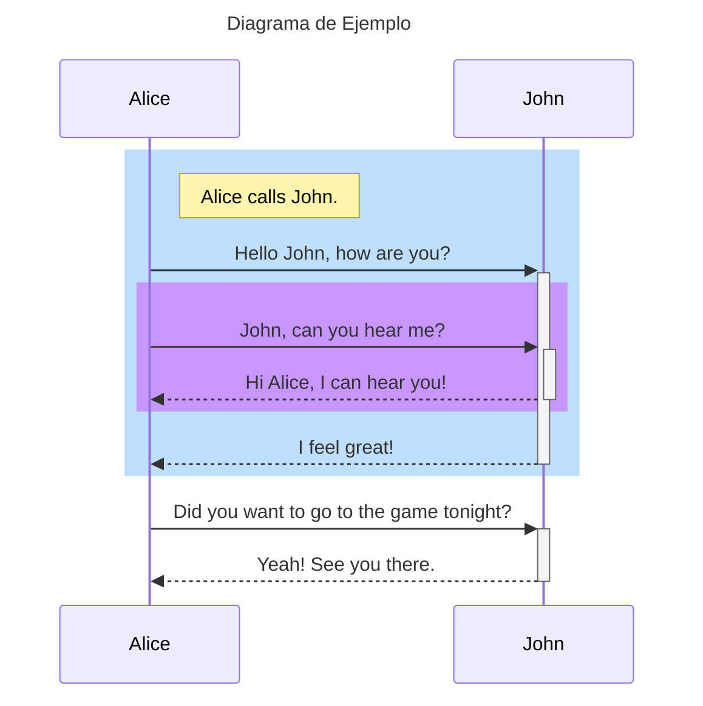

# Introducción

En este repositorio se estará mostrando documentación global sobre nuestras ideas y proyectos.

Proyecto hecho con https://docusaurus.io/

---

## Diagramas

En este proyecto se podrán diseñar diagramas desde el mismo archivo de documentación, te muestro un ejemplo:

